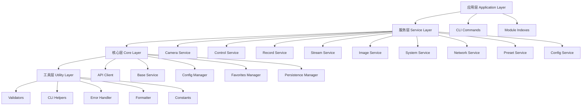

# Z CAM CLI 测试计划

## 📋 概述

本文档描述了Z CAM CLI的完整测试策略和执行计划，确保代码质量和功能稳定性。

## 🎯 测试目标

- **代码覆盖率**: 目标90%以上
- **测试类型**: 单元测试、集成测试、真实连接测试
- **测试原则**: 真实连接优先，Mock辅助
- **质量保证**: 每个提交都通过完整测试套件

## 🏗️ 架构层级



## 📊 测试覆盖计划

### Phase 1: 工具层测试 (Utility Layer) - 优先级: 🔥 高

**目标**: 验证基础工具函数的正确性和健壮性

#### 1.1 验证器模块 (`src/validators/`)
```
tests/unit/validators/
├── network.test.js ✅ 已完成
└── [未来添加其他验证器]
```

**测试覆盖**:
- ✅ IP地址验证
- ✅ 端口号验证
- ✅ 超时时间验证
- ✅ 域名验证
- ✅ 网络配置验证
- ✅ 参数规范化

#### 1.2 工具函数模块 (`src/utils/`)
```
tests/unit/utils/
├── errors.test.js              # 错误处理工具
├── formatter.test.js           # 输出格式化
├── cli-helpers.test.js         # CLI辅助函数
├── command-base.test.js        # 命令基类
└── error-handler.test.js       # 错误处理器
```

**测试覆盖**:
- 错误类创建和处理
- 表格/JSON/CSV格式化
- 命令行参数解析
- 全局选项处理
- 错误捕获和格式化

#### 1.3 常量模块 (`src/constants/`)
```
tests/unit/constants/
└── index.test.js               # 常量定义验证
```

**测试覆盖**:
- 网络默认值
- API端点定义
- 验证范围定义
- 用户权限定义

### Phase 2: 核心层测试 (Core Layer) - 优先级: 🔥 高

**目标**: 验证核心组件的可靠性和配置管理

#### 2.1 API客户端 (`src/core/api.js`)
```
tests/unit/core/
└── api.test.js
```

**测试覆盖**:
- HTTP请求方法 (GET/POST/PUT/DELETE)
- 会话管理和Cookie处理
- 请求限流和超时控制
- 错误处理和重试机制
- 连接状态管理

#### 2.2 配置管理 (`src/config/`)
```
tests/unit/config/
├── fallback.test.js ✅ 已完成
├── env.test.js
├── resolver.test.js
└── exact-resolver.test.js
```

**测试覆盖**:
- ✅ Fallback策略管理
- 环境变量配置
- 配置解析和验证
- 多级回退机制
- 配置差异分析

#### 2.3 服务管理 (`src/core/services/`)
```
tests/unit/core/services/
├── favorites-manager.test.js
├── settings-manager.test.js
└── persistence-manager.test.js
```

**测试覆盖**:
- 收藏相机管理
- 设置持久化
- 数据存储和读取
- Schema验证

#### 2.4 基础服务 (`src/core/base-service.js`)
```
tests/unit/core/
└── base-service.test.js
```

**测试覆盖**:
- 服务基类功能
- 通用方法实现

### Phase 3: 服务层测试 (Service Layer) - 优先级: 🔶 中

**目标**: 验证业务逻辑的正确性，使用真实API连接

#### 3.1 相机服务 (`src/modules/camera/`)
```
tests/unit/modules/camera/
└── service.test.js
```

**真实API测试覆盖**:
- 相机信息获取
- 工作模式查询
- 昵称管理
- 时间同步
- 用户管理
- 控制参数操作

#### 3.2 控制服务 (`src/modules/control/`)
```
tests/unit/modules/control/
└── service.test.js
```

**测试覆盖**:
- PTZ云台控制
- 镜头控制
- 移动命令

#### 3.3 其他服务模块
```
tests/unit/modules/
├── record/service.test.js      # 录制控制
├── stream/service.test.js      # 流媒体控制
├── image/service.test.js       # 图像调整
├── system/service.test.js      # 系统管理
├── network/service.test.js     # 网络配置
├── preset/service.test.js      # 预设位置
└── config/service.test.js      # 配置管理
```

### Phase 4: 应用层测试 (Application Layer) - 优先级: 🔹 低

**目标**: 验证CLI命令和路由逻辑

```
tests/unit/modules/
├── camera/index.test.js
├── control/index.test.js
├── record/index.test.js
├── stream/index.test.js
├── image/index.test.js
├── system/index.test.js
├── network/index.test.js
├── preset/index.test.js
└── config/index.test.js
```

**测试覆盖**:
- 命令注册和路由
- 参数验证
- 帮助信息生成

## 🎯 测试策略原则

### 1. 真实连接优先原则

```javascript
const testStrategy = {
  network: 'REAL_CONNECTION',    // 使用真实相机API (192.168.9.59)
  fileIO: 'REAL_FILESYSTEM',     // 真实文件操作
  time: 'MOCK_TIME',            // 模拟时间避免测试超时
  externalAPI: 'MOCK_EXTERNAL'  // 外部服务Mock
};
```

### 2. 测试数据管理

```javascript
// 测试用真实相机数据
const testCamera = {
  host: '192.168.9.59',
  port: 80,
  timeout: 15000,
  model: 'e2ptz',
  serial: '91PT0002216'
};
```

### 3. 错误处理测试

- 网络连接失败
- 相机响应错误
- 参数验证失败
- 配置解析错误

### 4. 性能测试

- 请求响应时间
- 内存使用情况
- 并发处理能力

## 📈 执行计划

### Week 1: 基础层 + 核心层
- ✅ **已完成**: 真实相机连接测试 (100%通过)
- 🔄 **进行中**: 单元测试框架搭建
- 📋 **待开始**: 工具层测试 (utils/, validators/, constants/)
- 📋 **待开始**: 核心层测试 (api/, config/, services/)

### Week 2: 服务层 + 应用层
- 📋 **待开始**: 业务服务测试 (camera, control, record等)
- 📋 **待开始**: CLI命令测试
- 📋 **待开始**: 集成测试
- 📋 **待开始**: 覆盖率报告生成

## 🚀 立即执行顺序

### 1. 工具层测试 (立即开始)
```bash
# 执行顺序
npm test -- --testPathPatterns=validators
npm test -- --testPathPatterns=utils
npm test -- --testPathPatterns=constants
```

### 2. 核心层测试 (并行进行)
```bash
# 执行顺序
npm test -- --testPathPatterns=core/api
npm test -- --testPathPatterns=core/config
npm test -- --testPathPatterns=core/services
```

### 3. 服务层测试 (真实验证)
```bash
# 执行顺序 (使用真实相机)
npm test -- --testPathPatterns=modules/camera
npm test -- --testPathPatterns=modules/control
npm test -- --testPathPatterns=modules/record
# ... 其他服务
```

## 📊 质量指标

### 代码覆盖率目标
- **总体覆盖率**: ≥90%
- **核心模块**: ≥95%
- **工具函数**: 100%
- **业务逻辑**: ≥85%

### 测试通过率目标
- **单元测试**: 100%通过
- **集成测试**: ≥95%通过
- **真实连接**: 100%通过

### 性能指标
- **API响应**: ≤5秒
- **内存使用**: ≤100MB
- **测试执行**: ≤2分钟

## 🛠️ 测试工具和配置

### 测试框架
- **Jest**: 主测试框架
- **Node.js**: 运行环境
- **真实相机**: 集成测试目标

### 配置文件
```javascript
// jest.config.js
module.exports = {
  testEnvironment: 'node',
  testTimeout: 30000,
  collectCoverageFrom: [
    'src/**/*.js',
    '!src/index.js',
    '!src/modules/*/index.js'
  ],
  coverageDirectory: 'coverage',
  coverageReporters: ['text', 'lcov', 'html']
};
```

### 测试环境
- **开发环境**: 本地测试
- **CI/CD**: 自动化测试
- **真实相机**: 192.168.9.59

## 📝 测试编写规范

### 测试文件命名
```
tests/unit/[module]/[filename].test.js
tests/integration/[feature].test.js
```

### 测试用例结构
```javascript
describe('[模块名称]', () => {
  describe('[功能分组]', () => {
    test('应该[具体行为]', () => {
      // Arrange
      // Act
      // Assert
    });
  });
});
```

### Mock策略
- **网络请求**: 真实连接优先
- **时间函数**: Mock避免超时
- **文件操作**: 真实文件系统
- **外部依赖**: Mock或Stub

## 🔍 测试结果记录

### 当前状态
- ✅ **真实相机连接**: 100%通过 (6/6)
- ✅ **网络验证器**: 完成测试
- ✅ **Fallback管理**: 完成测试
- 📋 **单元测试**: 进行中

### 测试报告
- **覆盖率报告**: `coverage/`
- **测试日志**: `tests/logs/`
- **失败截图**: `tests/screenshots/`

## 📚 参考资料

- [Jest文档](https://jestjs.io/docs/getting-started)
- [Node.js测试](https://nodejs.org/api/test.html)
- [Z CAM API文档](./ZCAM_API_COMPLETE.md)
- [项目架构文档](./ARCHITECTURE.md)

---

**最后更新**: 2025-01-06
**版本**: 1.0
**维护者**: Z CAM CLI开发团队